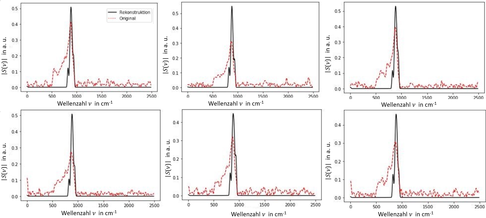
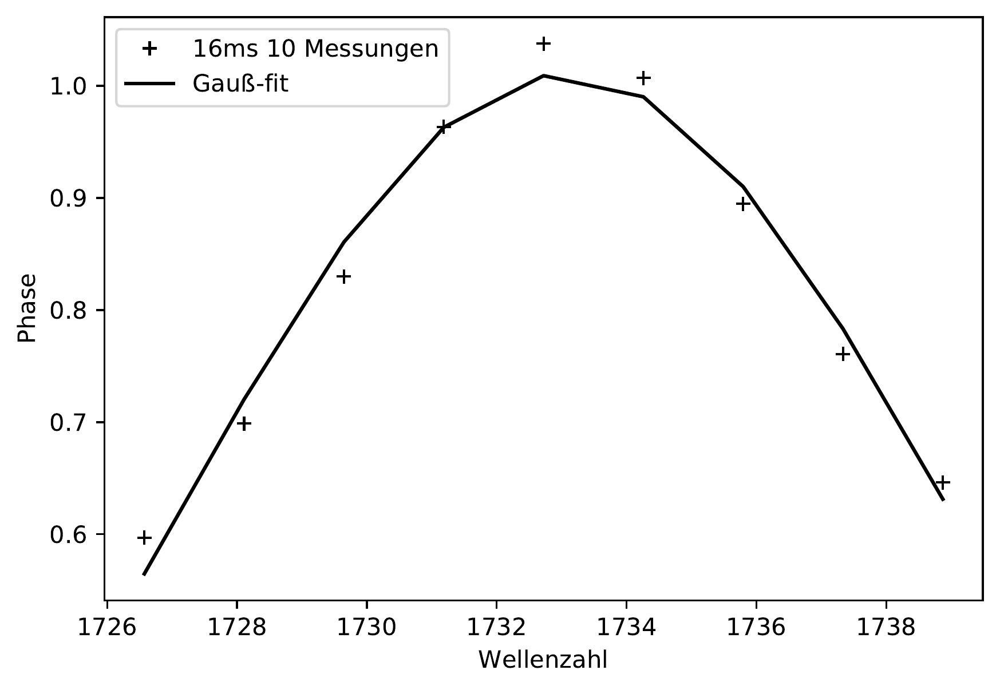
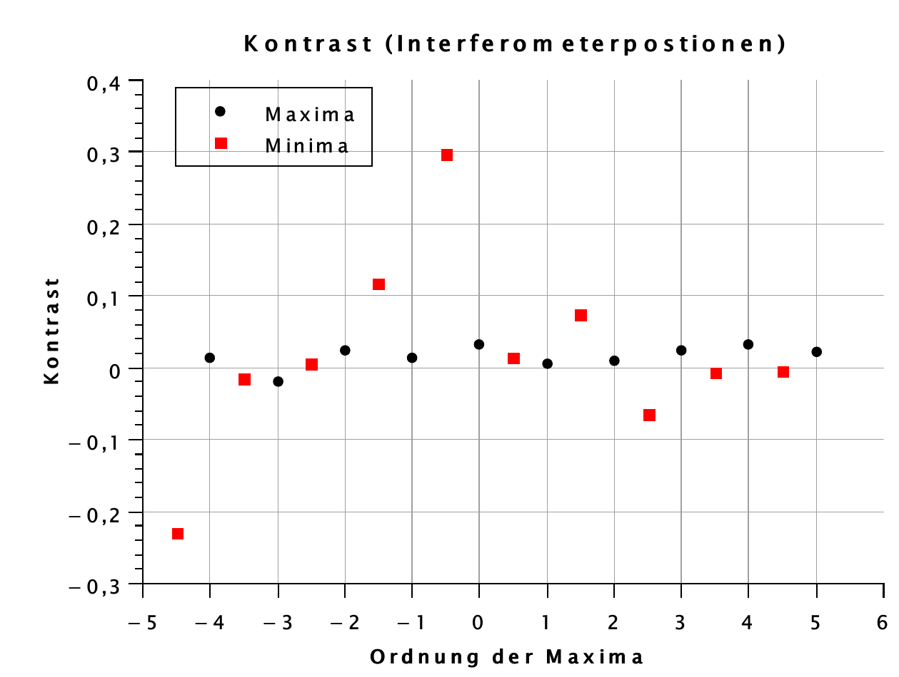

# PMMA Resolution and Contrast Study – nano-FTIR @ PTB Berlin

This repository documents a small experimental side project at the Physikalisch-Technische Bundesanstalt (PTB), Berlin.  
The project explores spatial resolution and spectral fidelity in **nano-FTIR measurements** of PMMA on Pt/SiO₂ structures, focusing on:

- The impact of **interferogram length** (600 vs. 800 points)
- Effects of **integration time and averaging**
- Contrast behavior under **white-light illumination**
- Gaussian fit analysis for signal-to-noise evaluation

---

## 🎯 Objectives

- Evaluate whether **600 points** is sufficient for resolving the **1730 cm⁻¹ PMMA absorption peak**.
- Test how **integration time (e.g., 8 ms vs. 16 ms)** and **repetitions** affect SNR.
- Analyze **contrast reversal** between Pt and SiO₂ under different interferometer positions.

---

## 📁 Structure

```bash
notebooks/
├── PMMA_800um_800_CLEANED.ipynb              # Baseline scan
├── PMMA_800um_600um_Plot_CLEANED.ipynb       # Resolution comparison
├── PMMA_800um_800um_allein_1_CLEANED.ipynb   # Single repetition
├── PMMA_alle_plots-Copy1_CLEANED.ipynb       # Combined analysis
data/
├── PMMA_Messungen.txt
├── 4Gaus1730.pdf
├── Kontrastbestimmung_1.pdf
figures/
├── WLspektra.png
├── gridspektra.png
├── gaussian_fit_1730.png
├── contrast_curve.png
README.md
```

---


---

## ⚙️ Methods Overview

- Spectra acquired via nano-FTIR setup with **infrared synchrotron radiation** (BESSY II)
- Sample: PMMA on Pt/SiO₂ structured chip
- Scans varied by:
  - Interferogram length: 600 vs. 800 points
  - Integration time: 8 ms / 16 ms
  - Repetitions: 1×, 10×
- Signal quality evaluated using **Gaussian fits** and **contrast profiles**

## 📊 Key Findings

### 1. Resolution and Oversampling

Although 600 points satisfies Nyquist in theory, the **1730 cm⁻¹ PMMA peak** is often lost in practice unless:
- More points (800) are used, **or**
- More scans (10×) or longer integration (16 ms) are performed.



Gaussian fits confirm the **SNR improves significantly** under longer or repeated scans.

---

### 2. Signal-to-Noise via Gaussian Fit

This fit was applied to the 1730 cm⁻¹ absorption band to estimate the **SNR**:



Result:
- 800 points + 16 ms × 10 scans provided the clearest peak shape.
- Shorter scans or 600-point acquisitions often lacked enough fidelity.

---

### 3. Contrast Study

Unexpectedly, **contrast flipped** in some measurements — with SiO₂ appearing brighter than Pt.

This was traced to interferometer position aligning with **Pt minima**, altering fringe visibility.



> "The best contrast is not necessarily at the global maximum of the interferogram."  
> — Observation during white-light scan

---

## 🔬 Experimental Setup

- nano-FTIR system @ PTB Berlin
- Sample: PMMA layer on Pt/SiO₂ substrate
- IR synchrotron radiation from BESSY II
- White-light scanning for contrast analysis

---

## 📜 License & Acknowledgment

Unpublished project by **Barbara Vinatzer**, with support from PTB Berlin, 2020.

---

## 🙋‍♀️ Author

**Barbara Vinatzer**  
Research Assistant, TU Dresden (SynoSys)  
[GitHub](https://github.com/Batuffola)

---

## 📆 Project History

🗓️ This project was conducted between **June and August 2020** as a side research study during my time at **PTB Berlin**.  
It complements my later Bachelor's thesis on compressed sensing in nano-FTIR spectroscopy.
