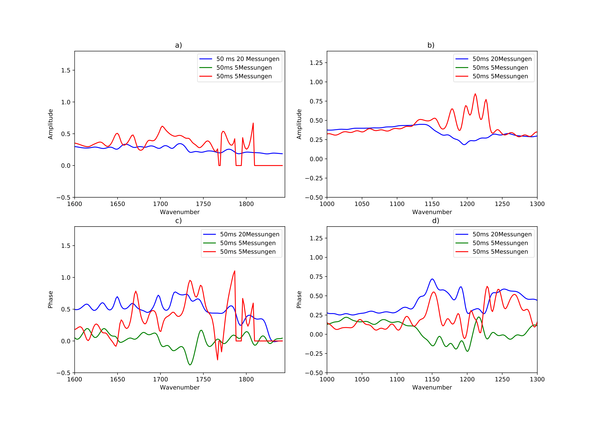
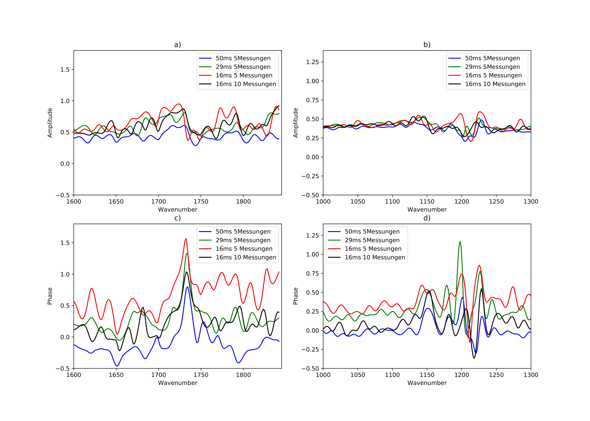

# PMMA Resolution and Contrast Study – nano-FTIR @ PTB Berlin

This repository documents a side research project at the Physikalisch-Technische Bundesanstalt (PTB), Berlin.  
It explores spatial resolution and spectral fidelity in **nano-FTIR measurements** of PMMA on Pt/SiO₂ structures, focusing on:

- The impact of **interferogram length** (600 vs. 800 points)
- Effects of **integration time and averaging**
- Contrast behavior under **white-light illumination**
- Gaussian fit analysis for signal-to-noise evaluation

---

## 🎯 Objectives

- Evaluate whether **600 points** is sufficient for resolving the **1730 cm⁻¹ PMMA absorption peak**.
- Test how **integration time (e.g., 8 ms vs. 16 ms)** and **repetitions** affect SNR.
- Analyze **contrast reversal** between Pt and SiO₂ under different interferometer positions.

---

## 📁 Structure

```bash
notebooks/
├── PMMA_800um_800_ENHANCED.ipynb
├── PMMA_800um_600um_Plot_ENHANCED.ipynb
├── PMMA_800um_800um_allein_1_ENHANCED.ipynb
├── PMMA_alle_plots-Copy1_ENHANCED.ipynb
figures/
├── pmma_resolution_comparison.png
├── gaussian_fit_1730.png
├── contrast_curve.png
docs/
└── Studienprojekt_BV-1.pdf
README.md
```

---

## ⚙️ Methods Overview

- Spectra acquired via nano-FTIR setup with **infrared synchrotron radiation** (BESSY II)
- Sample: PMMA on Pt/SiO₂ structured chip
- Scans varied by:
  - Interferogram length: 600 vs. 800 points
  - Integration time: 8 ms / 16 ms
  - Repetitions: 1×, 10×
- Signal quality evaluated using **Gaussian fits** and **contrast profiles**

---

## 📊 Key Findings

### 1. Resolution and Oversampling

Although 600 points satisfies Nyquist in theory, the **1730 cm⁻¹ PMMA peak** is often lost in practice unless:
- More points (800) are used, **or**
- More scans (10×) or longer integration (16 ms) are performed.

Below: comparison of **600-point** and **800-point** scans under various integration times and repetitions.

<table>
<tr>
<td><b>600 Points</b><br></td>
<td><b>800 Points</b><br></td>
</tr>
</table>


### 2. Signal-to-Noise via Gaussian Fit

This fit was applied to the 1730 cm⁻¹ absorption band to estimate the **SNR**:


---

### 3. Contrast Study

Unexpectedly, **contrast flipped** in some measurements — with SiO₂ appearing brighter than Pt.

This was traced to interferometer position aligning with **Pt minima**, altering fringe visibility.


> "The best contrast is not necessarily at the global maximum of the interferogram."  
> — Observation during white-light scan

---

## 📄 Full Project Report

Full documentation and context available in:  
📄 [`Studienprojekt_BV.pdf`](docs/Studienprojekt_BV.pdf)

---

## ✅ Conclusion

This project illustrates how real-world nano-FTIR measurements may deviate from theoretical expectations (e.g., Nyquist sampling).  
Key takeaways:

- **Oversampling is critical** to resolve subtle absorption features like the 1730 cm⁻¹ PMMA peak.
- **Repetition and integration time** significantly improve spectral clarity.
- **Contrast optimization** depends on interferometer alignment and material-specific response.
- Even in a short side project, practical insight into acquisition planning and signal analysis can contribute to better spectral reconstruction.

This repository complements and extends the findings discussed in my Bachelor's thesis on compressed sensing for nano-FTIR.

---


---

## 🔬 Why This Matters

- Demonstrates how theoretical minimums (like Nyquist sampling) **don’t always hold up in practice**
- Highlights the importance of **instrument timing and repetition** in sensitive spectroscopy
- Shows how small measurement details (like **interferometer positioning**) can cause large contrast effects
- Provides a template for designing and optimizing nano-FTIR experiments under real constraints

---
## 📆 Project History

🗓️ This project was conducted between **June and August 2020** as a side research study during my time at **PTB Berlin**.  
It complements my later Bachelor's thesis on compressed sensing in nano-FTIR spectroscopy.

---

## 🙋‍♀️ Author

**Barbara Vinatzer**  
[GitHub](https://github.com/Batuffola)
